# 激活码管理系统

> 面向 **多项目**、**双授权模型（TIME / COUNT）** 与 **插件 / 客户端正式接入** 场景打造的一体化授权后台。
> 你可以用它管理项目、批量发码、追踪消费日志、查看趋势统计，也可以直接把公开 API 文档发给接入方完成联调。

<p>
  
  
  
  = 22" />
  
</p>

## 快速导航

- [项目定位](#项目定位)
- [核心能力](#核心能力)
- [首页概览](#首页概览)
- [3 分钟快速开始](#3-分钟快速开始)
- [Docker 部署](#docker-部署)
- [GitHub 自动发布 DockerHub](#github-自动发布-dockerhub)
- [推荐接入流程](#推荐接入流程)
- [管理后台可以做什么](#管理后台可以做什么)
- [一眼看懂系统原理](#一眼看懂系统原理)
- [安全与工程保障](#安全与工程保障)
- [FAQ](#faq)

## 一眼看懂它适合什么场景

| 你要解决的问题 | 这个项目怎么支持 |
|---|---|
| 我有多个产品 / 多个客户，需要隔离激活码空间 | 通过 `projectKey` 做多项目隔离，每个项目独立启停、独立发码 |
| 我既有订阅制，也有按次扣费 | 同时支持 `TIME` 和 `COUNT` 两种授权模型 |
| 我有浏览器插件 / 客户端，需要正式 API | 内置 `activate / status / consume` 正式接口与兼容 `/api/verify` |
| 我怕客户端重试导致重复扣次 | `consume` 支持 `requestId` 幂等 |
| 我不想每次都口头给接入方解释接口 | 公开 API 文档页 `/docs/api` + SDK + smoke 脚本 |
| 我需要对账和排查问题 | 后台提供消费日志、趋势图、统计、CSV 导出 |

## 项目定位

这个项目不是一个“只能生成激活码”的简单后台，而是一个完整的授权运营中心：

- 支持 **多个项目并行管理**，每个项目都有独立 `projectKey`、启停状态与发码空间
- 同时支持 **时间型授权** 与 **次数型授权**
- 内置 **正式 API（activate / status / consume）** 与兼容接口 `/api/verify`
- 提供 **公开 API 文档页**、**JS/TS SDK**、**本地 smoke 联调脚本**
- 后台支持 **项目管理、激活码管理、消费日志、趋势统计、系统配置、密码修改**
- 开发环境支持 **自动初始化**，开箱即可跑起来

---

## 核心能力

### 1. 多项目隔离
- 每个项目都有独立的 `projectKey`
- 激活码归属于项目，避免不同产品 / 客户之间串用
- 支持项目搜索、排序、分页、启停、空项目删除
- 默认项目 `default` 保留为兼容入口

### 2. 双授权模型

#### 时间型 `TIME`
- 首次激活时绑定设备
- **从激活时刻开始**计算有效期
- 后续 `status / consume` 只做有效性校验，不扣减次数

#### 次数型 `COUNT`
- 一个激活码可以代表 **N 次使用**
- `activate` 只绑定设备，不扣次
- `consume` 每次真实业务发生时扣减 1 次
- 支持 `requestId` 幂等，避免客户端重试导致重复扣次

### 3. 正式接入 API
推荐新插件 / 新客户端优先使用：

- `POST /api/license/activate`
- `POST /api/license/status`
- `POST /api/license/consume`

兼容旧接口：

- `POST /api/verify`

项目内已内置：

- 公开 API 文档页：`/docs/api`
- SDK：`src/lib/license-sdk.ts`
- 自动化联调脚本：`npm run smoke:license-api`

### 4. 运营与排查能力
- 后台总览统计与项目级统计
- 次数使用率、峰值消费项目等运营洞察
- 最近 7 / 30 天消费趋势
- 按日 / 周 / 月聚合
- 项目对比、周期对比、非零桶筛选
- 消费日志按项目 / `requestId` / 机器 ID / 时间范围检索
- CSV 导出（激活码、统计、消费日志、趋势）

### 5. 安全与后台管理
- 管理员登录 + JWT 会话管理
- 登录限流，降低暴力破解风险
- IP 白名单访问控制
- 管理员密码修改
- 系统配置管理（白名单 / JWT / bcrypt 成本 / 系统名称等）

## 能力总览

| 能力模块 | 支持内容 |
|---|---|
| 项目管理 | 项目创建、描述维护、`projectKey` 复制、搜索、筛选、排序、分页、启停、空项目删除 |
| 激活码生成 | 批量生成时间型 / 次数型激活码 |
| 激活码管理 | 列表查看、状态判断、规格查看、删除、过期绑定清理 |
| License API | `activate / status / consume / verify` |
| SDK 与文档 | JS/TS SDK、公开 API 文档页、多语言示例 |
| 消费日志 | 项目 / `requestId` / 机器 ID / 时间范围过滤、服务端分页、CSV 导出 |
| 趋势统计 | 7 / 30 天趋势、按日/周/月聚合、周期对比、项目对比、非零桶筛选 |
| 安全配置 | JWT、白名单、密码强度、管理员密码修改 |

---

## 首页概览

首页已经整理成适合对外展示的落地页，首次打开就能看到：

- 多项目隔离
- TIME / COUNT 双授权模型
- 管理后台入口
- 公开 API 文档入口

<p align="center">
  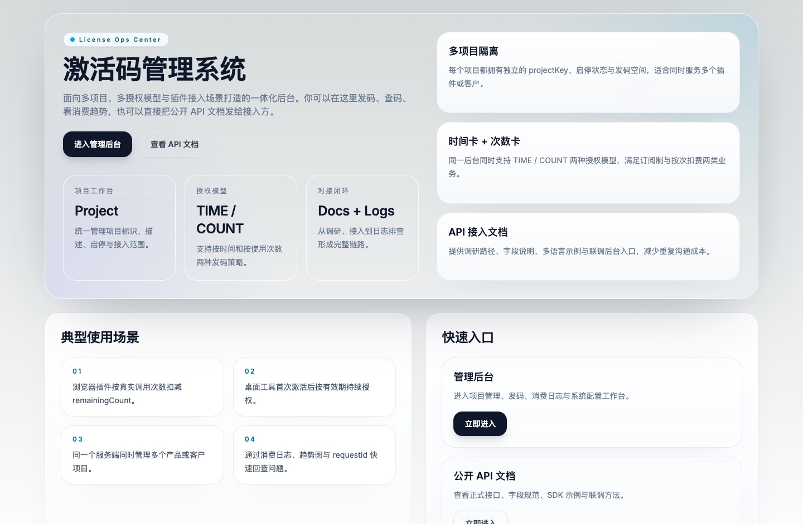
</p>

---

## 适用场景

### 浏览器插件按次计费
- 一个激活码代表 N 次调用额度
- 插件每次真实使用时调用 `consume`
- 通过 `requestId` 避免重复扣次
- 后台可按 `requestId` / 机器 ID / 时间范围排查问题

### 桌面工具按有效期授权
- 用户首次输入激活码时调用 `activate`
- 有效期从首次激活开始计算
- 后续通过 `status` 查询是否仍有效

### 同一套服务支持多个产品 / 客户
- 每个项目对应独立 `projectKey`
- 同一台设备可在不同项目下分别绑定授权
- 同一项目下保持唯一有效绑定，旧卡耗尽 / 过期后才允许切换

---

## 3 分钟快速开始

### 环境要求
- Node.js `>= 22`
- npm
- `sqlite3` 与 `openssl` 命令行工具（仅本地 Node 模式的初始化 / 测试需要；如果直接用 Docker 运行，可不在宿主机安装）

> 推荐直接使用仓库根目录的 `.nvmrc` 对齐本地、CI 与 Docker 的 Node 主版本；当前完整 `quality:gate` 依赖 Node 22 的原生测试覆盖率阈值参数。

### 1）安装依赖

```bash
nvm use
npm install
```

如果你本地没有 `nvm`，只要保证 `node -v` 至少为 `v22.x` 即可。
如果你是 Linux 开发机，且后续要执行 `bootstrap:dev` / `quality:gate` / 测试，请先安装 `sqlite3` 与 `openssl`。

### 2）启动开发环境

```bash
npm run dev
```

> `npm run dev` 会先自动执行 `predev -> bootstrap:dev`，自动补齐本地开发数据库、默认管理员和系统配置。

### 3）访问系统

本地默认地址：

- 首页：`http://localhost:3000`
- 管理后台登录：`http://localhost:3000/admin/login`
- 公开 API 文档：`http://localhost:3000/docs/api`

如果你是第一次部署，建议先从登录页进入后台：

<p align="center">
  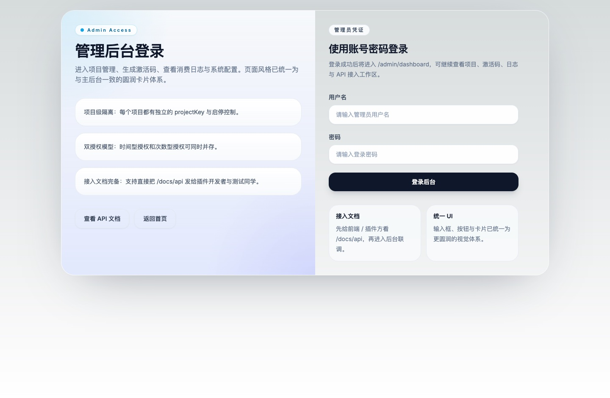
</p>

默认管理员账号：

- 用户名：`admin`
- 密码：`123456`

> 首次登录后建议立即修改密码。

### 4）如果你想手动初始化

```bash
# 一次性初始化开发环境
npm run bootstrap:dev

# 单独初始化默认管理员
npm run init-default-admin

# 单独初始化系统配置
npm run init-system-config
```

系统会自动补齐：
- `prisma/dev.db`
- 业务表结构
- 默认项目 `default`
- 默认管理员 `admin / 123456`
- 默认系统配置

### 5）本地联调 smoke

服务启动后可直接执行：

```bash
BASE_URL=http://127.0.0.1:3000 npm run smoke:license-api
```

这个脚本会自动完成：
- 管理员登录
- 创建项目
- 生成次数型激活码
- `activate`
- `status`
- `consume`
- 幂等重放验证
- 后台消费日志 / 统计 / 导出验证

### 6）如果你要跑生产构建模式

```bash
npm run build
npm run start
```

> 项目已将开发产物与生产构建产物隔离：`dev` 使用 `.next`，`build/start` 使用 `.next-build`。

---

## Docker 部署

这个项目 **直接使用 Docker 就可以运行，不依赖 Docker Compose**。

- 如果你只是单机部署一套服务：**推荐直接 `docker run`**
- 如果你想顺手管理 `.env`、日志、重建和停止流程：再使用 `docker compose`

仓库内已经补齐：

- `Dockerfile`
- `docker-compose.yml`
- `.env.docker.example`
- `scripts/docker-entrypoint.sh`
- `scripts/bootstrap-runtime.ts`

其中 `.env.docker.example` 里除了 `JWT_SECRET`，还提供了 `ALLOWED_IPS` 示例配置。

> 注意：`.env.docker.example` 更偏向**本地联调友好**，因此默认放行了常见私网段；正式部署前请务必按真实来源地址收紧。

### 方式 A：直接 `docker run`（推荐）

#### 1）准备环境变量

```bash
cp .env.docker.example .env
```

至少要把 `.env` 里的 `JWT_SECRET` 改成你自己的高强度随机字符串。

另外建议同时检查：

- `ALLOWED_IPS`：示例配置默认带有 `10.0.0.0/8`、`172.16.0.0/12`、`192.168.0.0/16` 等常见本地私网段，用于放行宿主机经 Docker / Colima / Lima / 虚拟网桥访问后台的场景
- 如果你部署在正式服务器，请按实际来源 IP 收紧白名单，不要长期保留过宽的私网段规则

#### 2）构建镜像

```bash
docker build -t activation-manager:local .
```

#### 3）创建持久化卷

```bash
docker volume create activation_manager_data
```

#### 4）启动容器

```bash
docker run -d \
  --name activation-manager \
  --env-file .env \
  -p 3000:3000 \
  -v activation_manager_data:/app/data \
  --restart unless-stopped \
  activation-manager:local
```

> 我已经实测过：**直接 `docker run` 后容器可正常变为 `healthy`，并且完整 smoke 联调通过。**

#### 5）查看状态、日志与健康检查

```bash
docker ps
docker logs -f activation-manager
docker inspect --format '{{.State.Health.Status}}' activation-manager
```

#### 6）访问系统

- 首页：`http://localhost:3000`
- 管理后台登录：`http://localhost:3000/admin/login`
- 公开 API 文档：`http://localhost:3000/docs/api`

默认管理员仍为：

- 用户名：`admin`
- 密码：`123456`

> 容器首次启动后会自动补齐默认管理员、默认项目与默认系统配置；请首登后立即修改密码。

#### 7）跑一次真实 smoke 联调

```bash
BASE_URL=http://127.0.0.1:3000 npm run smoke:license-api
```

如果输出 `✅ 联调通过`，说明以下链路都已正常：

- 容器启动
- Prisma 初始化
- 默认管理员和系统配置补齐
- 后台登录
- 项目创建
- 次数型激活码生成 / 绑定 / 幂等扣次
- 消费日志、统计、CSV 导出

#### 8）停止与删除容器

```bash
docker stop activation-manager
docker rm activation-manager
```

### 方式 B：Docker Compose（可选）

如果你更习惯用 compose 管理环境变量、日志和重建流程，可以使用：

```bash
docker compose --env-file .env up -d --build
docker compose --env-file .env logs -f activation-manager
docker compose --env-file .env down
```

> 注意：compose 只是为了运维更方便，**不是这个项目的运行前提**。

### 容器启动时自动做了什么

容器入口脚本会在真正启动 Next.js 前自动执行：

1. 创建持久化目录 `/app/data`
2. 将应用实际访问的 `prisma/dev.db` 链接到 `/app/data/dev.db`
3. 执行 `npm run bootstrap:runtime`
4. 自动同步 Prisma schema
5. 自动补齐默认项目、默认管理员、默认系统配置
6. 最后再启动 `npm run start`

这意味着：

- **SQLite 数据可持久化**
- **容器重启不会重复插入种子数据**
- **生产环境如果没提供 `JWT_SECRET`，会直接失败并提示**
- **Docker 运行时与 CI / 本地开发统一使用 Node 22 主版本**

### 数据持久化说明

无论你用 `docker run` 还是 `docker compose`，都推荐把 `/app/data` 挂到命名卷或宿主机目录。

- 容器内持久化目录：`/app/data`
- 应用内数据库访问路径：`/app/prisma/dev.db`（通过符号链接映射到 `/app/data/dev.db`）

如果你改成宿主机目录挂载，例如挂到 `/app/data`，请确保宿主机目录对容器进程有写权限。

---

## GitHub 自动发布 DockerHub

仓库已新增工作流：

- `.github/workflows/docker-publish.yml`

它会在 **每次 push** 和 **手动触发** 时自动执行：

1. 先跑一遍 `npm run quality:gate`
2. 再用 `docker compose` 真正拉起容器并等待 `healthy`
3. 然后执行 `scripts/smoke-license-api.sh` 做真实接口联调
4. 最后构建并推送 DockerHub 镜像

> 这里在 CI 里使用 `docker compose`，只是为了把“启动容器、等待健康检查、执行 smoke”收口成一个稳定的流水线步骤；**项目运行本身并不依赖 compose**。

### 你需要配置的 GitHub Secrets

在 GitHub 仓库 `Settings -> Secrets and variables -> Actions` 中新增：

- `DOCKERHUB_USERNAME`：你的 DockerHub 用户名
- `DOCKERHUB_TOKEN`：你的 DockerHub Access Token

### 可选的 GitHub Repository Variable

可选新增：

- `DOCKERHUB_IMAGE_NAME`：镜像仓库名

如果不配置，工作流会默认使用当前 GitHub 仓库名作为 DockerHub 镜像名。

### 自动打的标签策略

工作流默认会生成并推送这些标签：

- 分支名标签，例如：`main`、`feature-login`
- Git tag 标签（如果你推了 tag）
- 提交 SHA 标签，例如：`sha-abc1234`
- `latest`（仅默认分支）

### 默认发布的平台架构

工作流默认会发布多架构镜像：

- `linux/amd64`
- `linux/arm64`

这样无论你的服务器是常见的 x86_64 云主机，还是 ARM 设备 / ARM 服务器，都可以直接拉取同一个镜像标签。

### 推荐的远端发布前自检

在你首次 push 触发自动发布前，建议本地先执行：

```bash
npm run quality:gate
docker compose --env-file .env.docker.example up -d --build
BASE_URL=http://127.0.0.1:3300 npm run smoke:license-api
docker compose --env-file .env.docker.example down -v
```

如果这 3 步都通过，通常 GitHub Actions 的 Docker 发布链路也会稳定通过。

如果你只想验证“直接 `docker run` 的运行链路”，也可以按上面的 Docker 部署章节直接启动容器，再执行一次：

```bash
BASE_URL=http://127.0.0.1:3000 npm run smoke:license-api
```

### 建议的 DockerHub 仓库命名

例如你的 DockerHub 用户名是 `yourname`，仓库名建议配置为：

- `activation-manager`

那么最终镜像就会发布到：

- `yourname/activation-manager:latest`
- `yourname/activation-manager:main`
- `yourname/activation-manager:sha-xxxxxxx`

---

## 推荐接入流程

推荐把插件 / 客户端接入理解为一个完整闭环：

1. 在后台创建项目，拿到 `projectKey`
2. 用户首次输入激活码时，调用 `activate`
3. 插件展示授权信息时，调用 `status`
4. 每次真实业务发生时，调用 `consume`
5. 联调时去后台消费日志按 `requestId` 反查
6. 最后用 `smoke:license-api` 做回归

如果你要把一个页面直接发给接入方，优先发这个公开文档页：

<p align="center">
  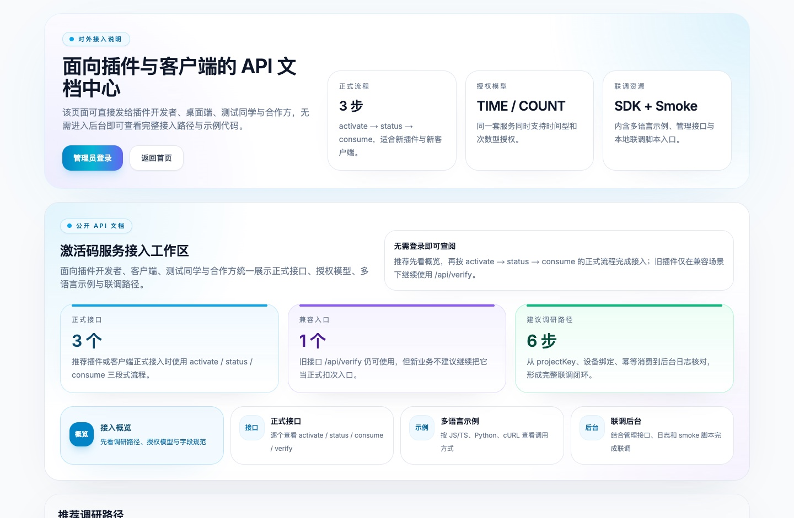
</p>

### 行为约定

- `activate`：绑定设备；次数型不扣次
- `status`：查询当前授权状态
- `consume`：真实业务发生时扣次；推荐总是传 `requestId`

### SDK

项目内已提供可直接复用的 SDK：

- `src/lib/license-sdk.ts`

最小使用示例：

```ts
import { createLicenseClient } from '@/lib/license-sdk'

const client = createLicenseClient({
  baseUrl: 'http://127.0.0.1:3000',
  projectKey: 'browser-plugin',
})

await client.activate({
  code: 'A1B2C3D4E5F6G7H8',
  machineId: 'machine-001',
})

await client.status({
  code: 'A1B2C3D4E5F6G7H8',
  machineId: 'machine-001',
})

await client.consume({
  code: 'A1B2C3D4E5F6G7H8',
  machineId: 'machine-001',
  requestId: 'req-001',
})
```

更完整的请求 / 响应 / 多语言示例请查看：

- 本地运行后的公开页面：`http://localhost:3000/docs/api`
- 仓库内详版文档：[apidocs.md](./apidocs.md)

公开文档页和后台联调工作区都已经按最新版 UI 重拍：

<p>
  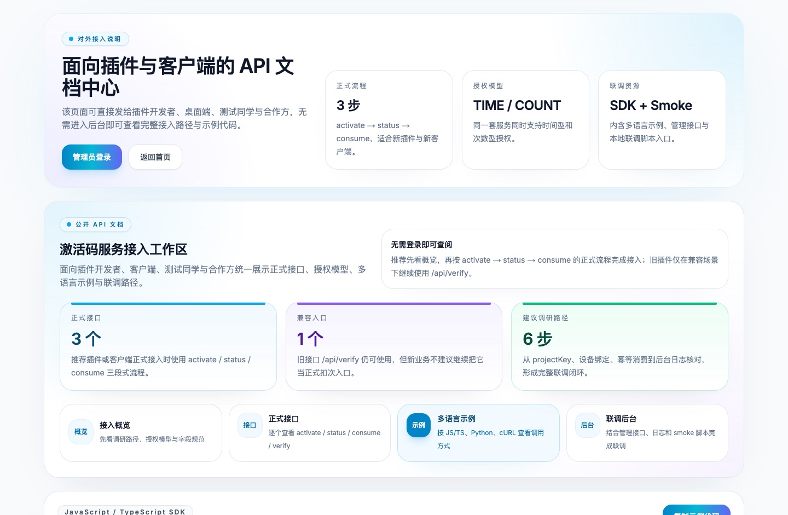
  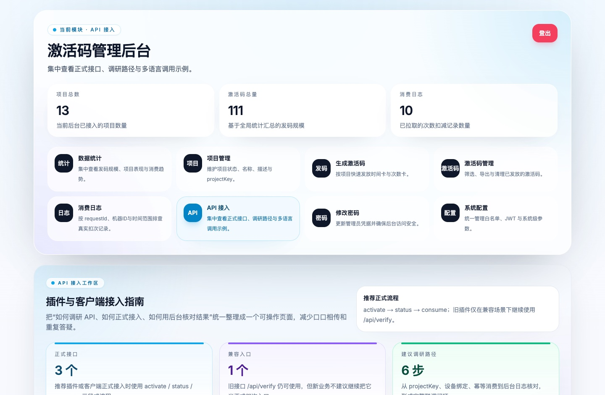
</p>

---

## 管理后台可以做什么

### 数据统计
- 查看总发码量、已使用、可用、已过期
- 查看项目级统计与次数使用率
- 查看消费趋势、周期对比与项目对比

<p align="center">
  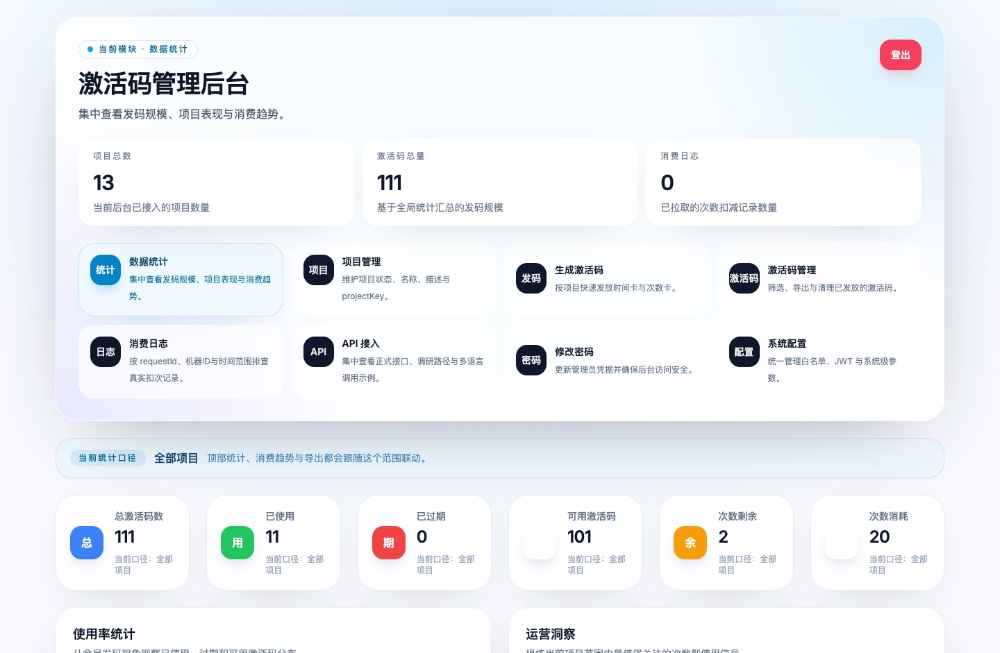
</p>

### 项目管理
- 创建项目
- 编辑项目名称 / 描述
- 一键复制 `projectKey`
- 搜索、筛选、排序、分页
- 启用 / 停用项目
- 删除空项目

<p align="center">
  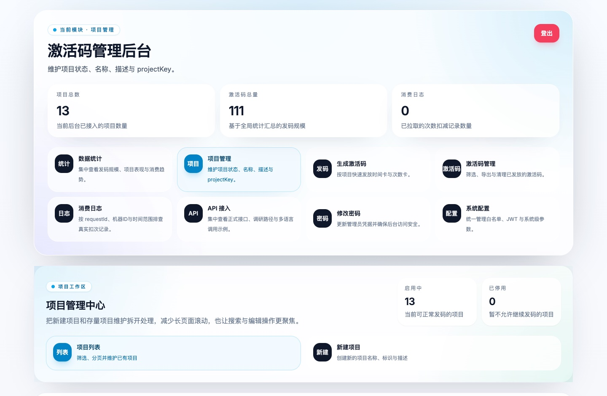
</p>

### 发码与码管理
- 批量生成时间型或次数型激活码
- 查看激活码状态、规格、过期时间、剩余次数
- 删除激活码
- 清理过期绑定

<p>
  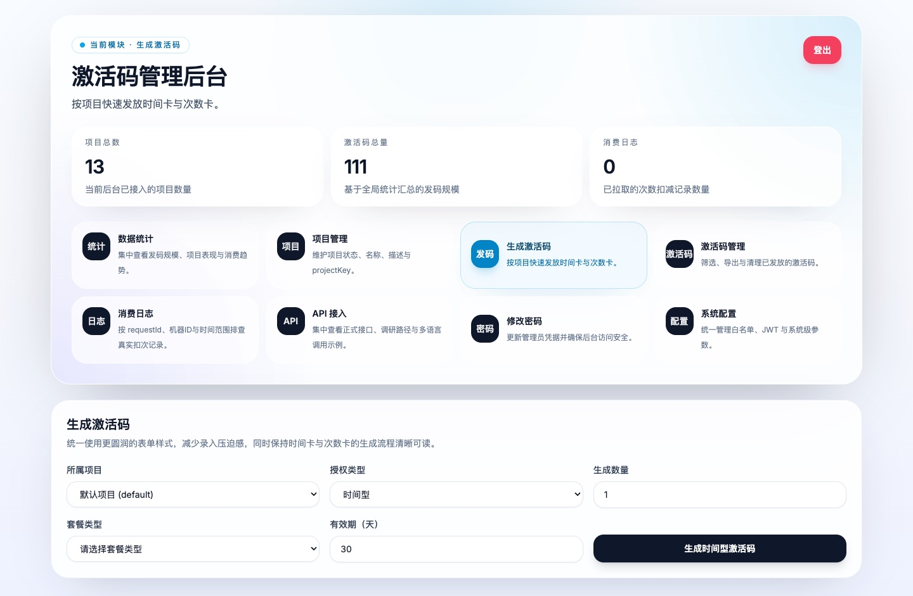
  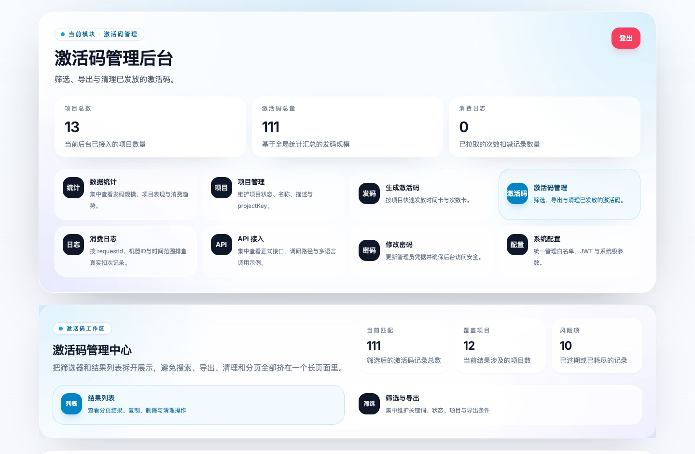
</p>

### 消费日志
- 查询次数型真实扣次记录
- 支持 `projectKey / requestId / machineId / 时间范围` 过滤
- 服务端分页 + CSV 导出

<p align="center">
  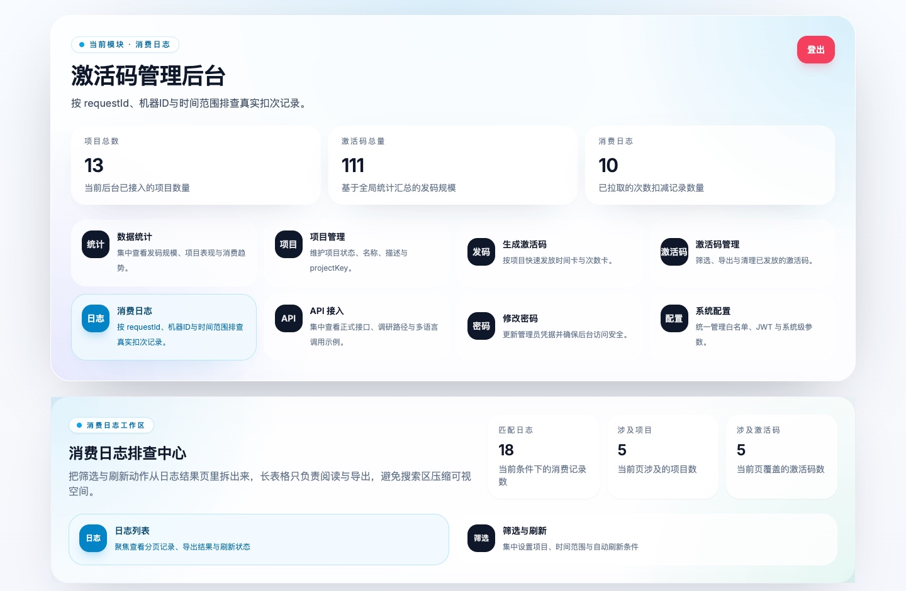
</p>

### 安全与配置
- 修改管理员密码
- 管理 IP 白名单
- 管理 JWT 有效期与密钥
- 管理密码哈希成本
- 管理系统展示名称等配置

<p>
  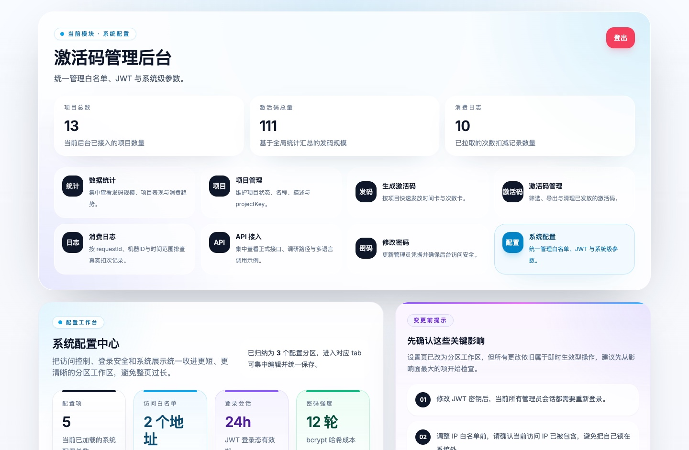
  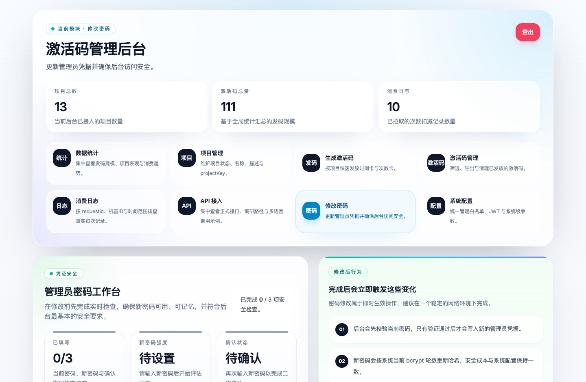
</p>

---

## 授权与绑定规则

### `projectKey` 规则
创建项目时，`projectKey` 需满足：

- 长度 `2 - 50`
- 仅允许小写字母 `a-z`、数字 `0-9`、短横线 `-`
- 不能以 `-` 开头或结尾
- 不能包含连续短横线 `--`

推荐示例：

- `browser-plugin`
- `plugin-a`
- `desktop-client`

### 设备绑定规则
- 同一台设备可以在 **不同项目** 下分别绑定激活码
- 但在 **同一项目** 下，同时只允许存在一个有效绑定
- 旧的次数卡已耗尽，或旧的时间卡已过期后，才允许切换到新卡

---

## 安全与工程保障

### 安全侧
- bcrypt 密码哈希（成本可配置）
- JWT 会话管理
- httpOnly Cookie
- 登录限流
- IP 白名单访问控制
- 页面层与 API 层统一后台鉴权 / 白名单判断

### 工程侧
- 通过 `.nvmrc` 统一本地、CI 与 Docker 的 Node 主版本
- `npm run dev` 与 `npm run build` / `npm start` 使用隔离的构建产物目录
- 开发环境自动初始化，减少首次运行成本
- 质量门禁：`lint + coverage + build`
- GitHub Actions 已配置质量门禁工作流
- 已支持 Docker 镜像构建、容器启动初始化与 DockerHub 自动发布

常用命令：

```bash
# 常规测试
npm test

# 覆盖率门禁
npm run test:coverage

# 提交前完整门禁
npm run quality:gate
```

CI 工作流位置：

- `.github/workflows/quality-gate.yml`
- `.github/workflows/docker-publish.yml`

---

## 项目结构

```text
.
├── .github/
│   └── workflows/
│       ├── docker-publish.yml
│       └── quality-gate.yml
├── prisma/
│   ├── schema.prisma
│   └── dev.db
├── scripts/
│   ├── bootstrap-dev.ts
│   ├── bootstrap-runtime.ts
│   ├── docker-entrypoint.sh
│   ├── init-default-admin.ts
│   ├── init-system-config.ts
│   ├── smoke-license-api.sh
│   └── backup-db.sh
├── src/
│   ├── app/
│   │   ├── admin/
│   │   ├── api/
│   │   ├── docs/api/
│   │   └── page.tsx
│   ├── components/
│   ├── lib/
│   ├── config.ts
│   └── middleware.ts
├── tests/
├── .env.docker.example
├── Dockerfile
├── docker-compose.yml
├── apidocs.md
├── xitonkaifa.md
└── README.md
```

---

## 一眼看懂系统原理

### 系统体系图

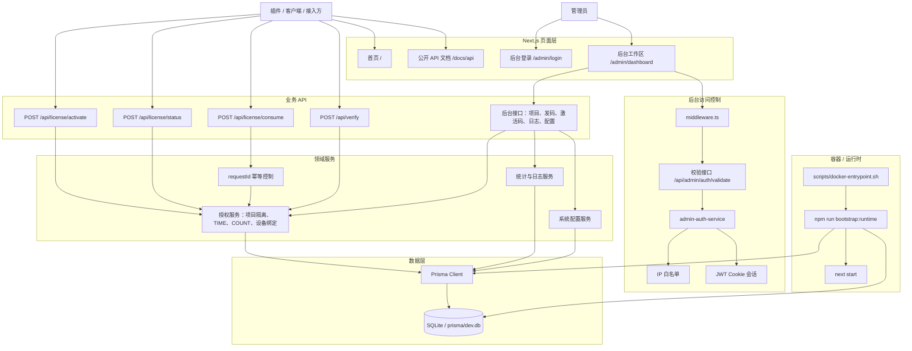

### 客户端验证流程图

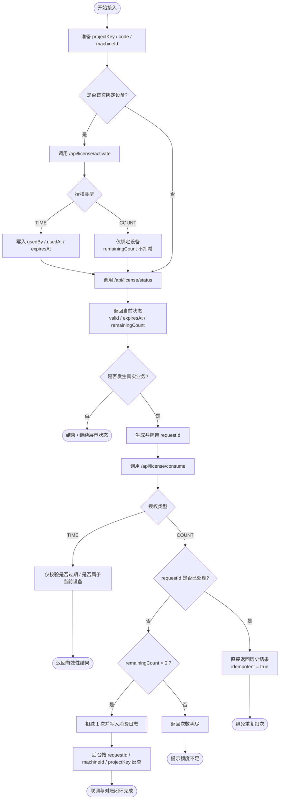

> 说明：对次数型授权来说，`activate` 只负责绑定设备，真正扣次只发生在 `consume`；<br/>
> 对时间型授权来说，首次激活后开始计算有效期，后续 `status / consume` 只做有效性校验。

---

## 相关文档

- [API 对接指南（详版）](./apidocs.md)
- [数据库备份指南](./DATABASE_BACKUP_GUIDE.md)
- [更新日志](./CHANGELOG.md)
- [开发说明](./xitonkaifa.md)
- [README 截图清单（最新版）](./Readmeimg/validation-20260326/README_SCREENSHOTS.md)

---

## 生产环境提示

生产环境初始化前，建议显式提供安全的 JWT 密钥：

```bash
JWT_SECRET="请替换为高强度随机字符串" npm run init-system-config
```

同时建议：
- 修改默认管理员密码
- 配置正确的白名单来源
- 启用 HTTPS
- 根据实际情况替换 SQLite / 调整部署方案

---

## FAQ

### `activate` 和 `consume` 的区别是什么？

- `activate`：首次绑定设备
- `status`：查询当前授权状态
- `consume`：真实业务发生时使用；次数型会扣减次数

对次数型授权来说，**不要把 `activate` 当作扣次接口**。

### 为什么推荐每次 `consume` 都传 `requestId`？

因为客户端、插件、网络层都可能发生重试。
传入 `requestId` 后，同一业务请求可以做到**幂等扣次**，避免重复消耗额度。

### 同一台设备能否在多个项目下使用？

可以。
同一设备可以在**不同项目**下分别绑定激活码；但在**同一项目**下，同时只允许一个有效绑定。

### 我应该把哪个页面发给接入方？

直接发：`/docs/api`

这个页面已经整理了：
- 正式接口
- 字段说明
- 多语言示例
- 联调路径
- 后台排查方式

---

## Stargazers over time

[](https://starchart.cc/axdlee/activation-manager)
