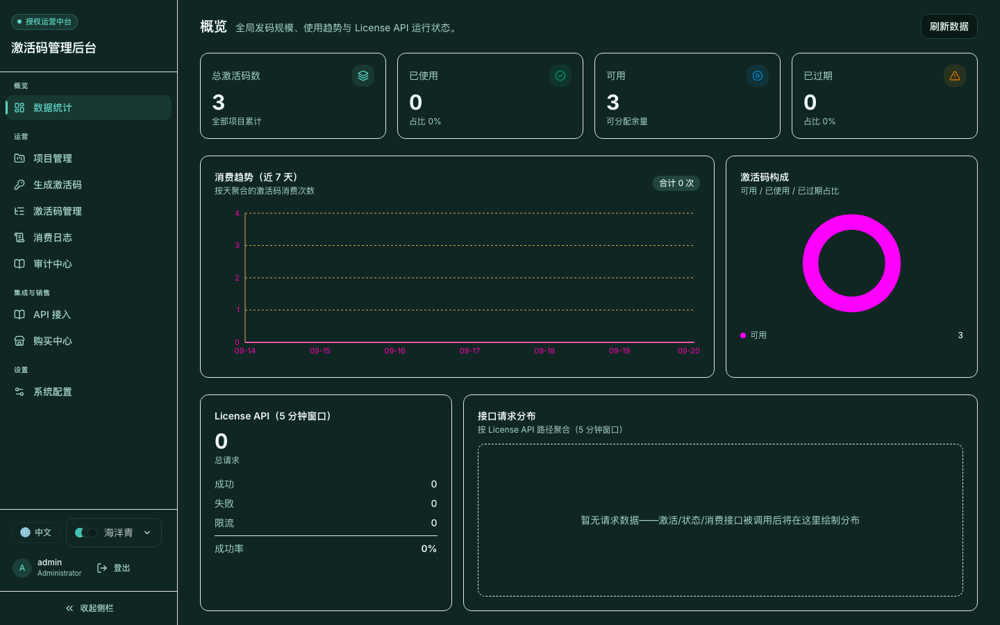
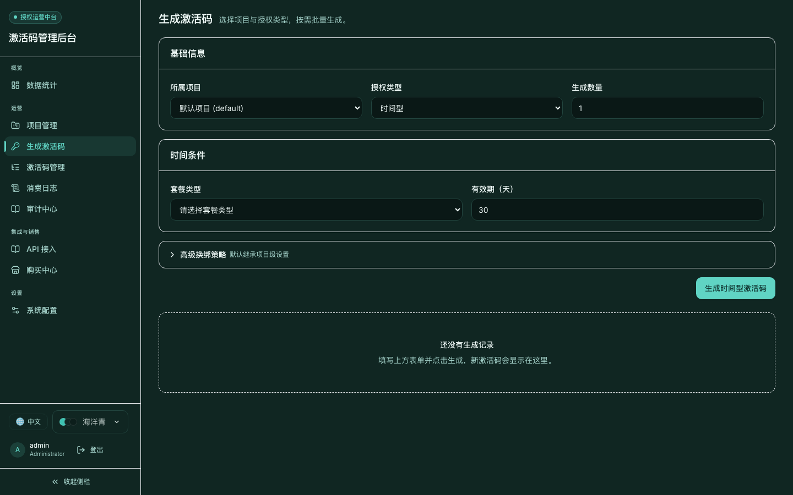
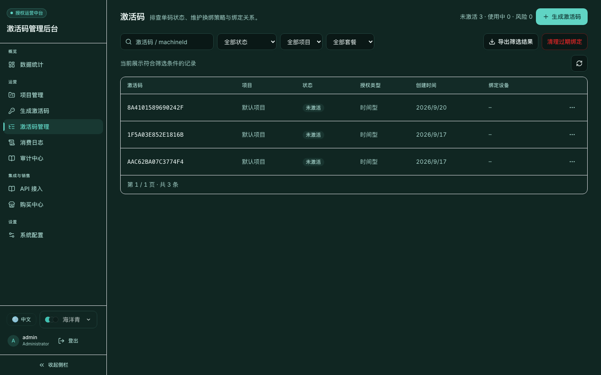
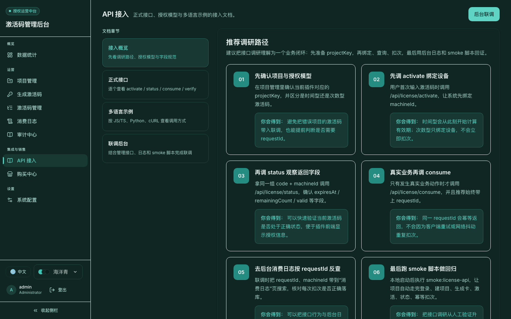
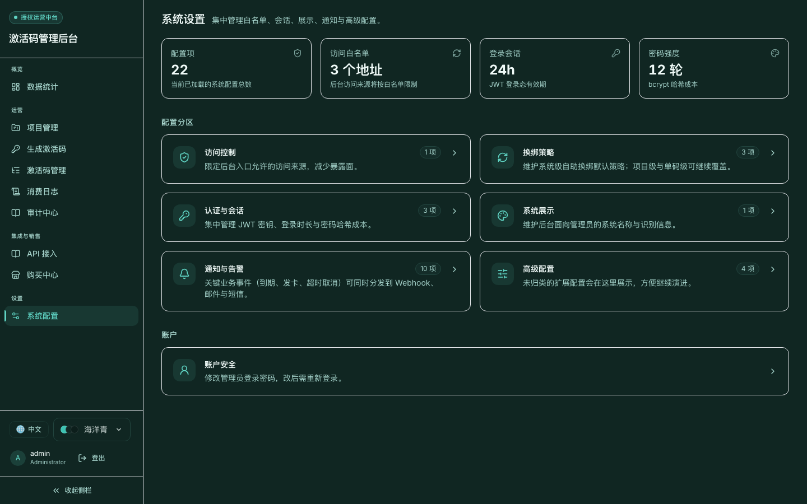
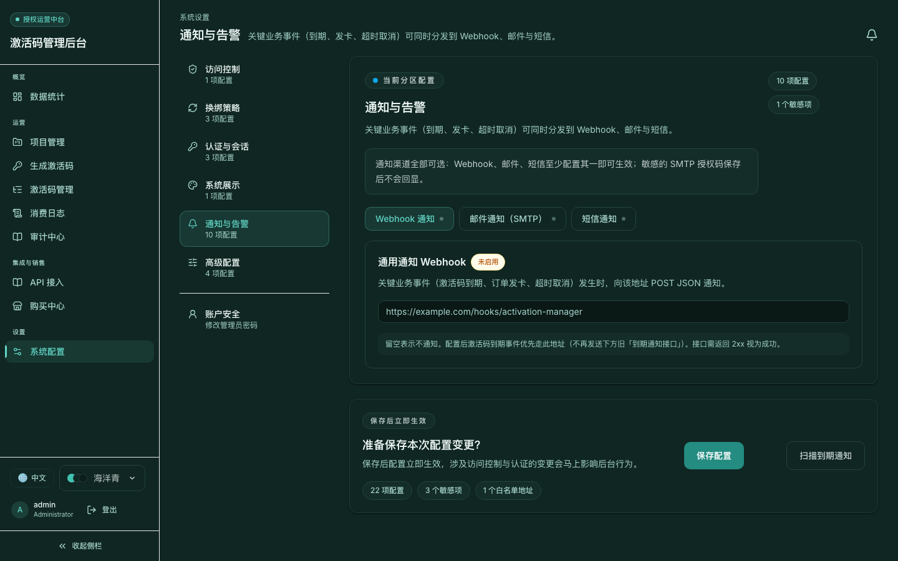
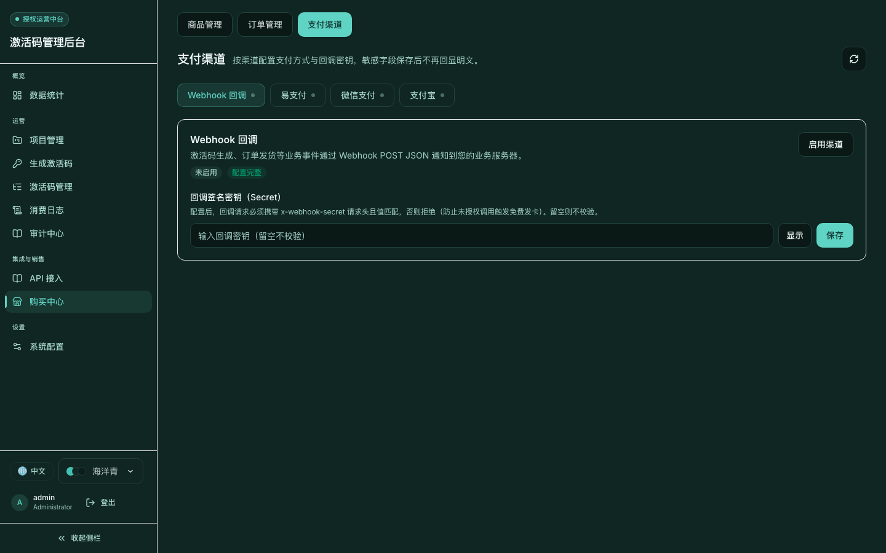
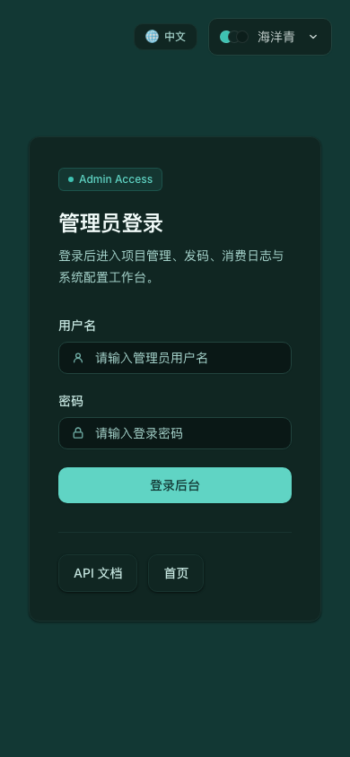

# 激活码管理系统（Activation Manager）

> 面向 **多项目**、**双授权模型（TIME / COUNT）** 与 **插件 / 客户端 / 桌面软件正式接入** 场景的一体化授权运营后台。
> 一套服务同时覆盖 **项目隔离、发码、激活、状态校验、按次扣减、销售闭环（商城 + 支付 + 自动发卡）、多渠道通知、日志排查、换绑治理与公开 API 文档**。

<p>
  
  
  
  
  = 22" />
  
  
</p>

<p align="center">
  
</p>

[English](./README.en.md) | 简体中文

---

## 目录

- [核心能力](#核心能力)
- [界面预览](#界面预览)
- [快速开始](#快速开始)
- [Docker 部署](#docker-部署)
- [环境变量](#环境变量)
- [公开 API 与多语言 SDK](#公开-api-与多语言-sdk)
- [管理后台模块](#管理后台模块)
- [主题与多语言](#主题与多语言)
- [测试与质量](#测试与质量)
- [目录结构](#目录结构)
- [更多文档](#更多文档)

## 核心能力

### 授权核心
- **双授权模型**：`TIME`（时间型，首次激活起算有效期）与 `COUNT`（次数型，`requestId` 幂等扣次）
- **多项目隔离**：`projectKey` 隔离发码空间、启停状态与治理策略，适配多产品 / 多客户并行运营
- **换绑治理**：单码换绑策略（继承 / 自定义冷却时间与次数上限）、强制解绑 / 强制换绑、绑定历史与管理员审计时间线
- **内置响应验签**：配置 `licenseResponseSecret` 后，公开 API 响应附带 HMAC-SHA256 签名（5 分钟时间窗），SDK 一行开启校验

### 公开 API 与客户端
- **正式接口**：`/api/license/activate` · `/api/license/status` · `/api/license/consume`（含限流、重试语义、响应验签）
- **兼容接口**：`/api/verify`（snake_case 旧协议平滑迁移）
- **16 语言 SDK**：TypeScript / Python / Go / Java / C# / PHP / Ruby / Rust / Kotlin / Swift / Dart / C / C++ / Scala / Groovy / Lua / Perl——统一超时、重试、响应归一与验签，单文件即可复制接入
- **在线 API 文档**：`/docs/api` 面向接入方的完整接口说明、示例代码与在线调试命令

### 销售闭环（商城）
- **公开购买页**：按项目展示商品，下单 → 支付 → 自动发卡 → 邮件送达卡密
- **支付渠道**：手动收款确认 / 易支付 / 微信支付 / 支付宝，渠道级启停与配置完整性检查
- **预定义码池防超卖**：商品绑定码池，库存实时扣减；订单超时自动取消并释放码池
- **订单运营**：确认发卡、补发邮件、订单清理，全部留审计

### 通知系统
- **多渠道分发**：Webhook / 邮件（SMTP）/ 短信可同时启用，关键事件（激活码到期、订单发卡、超时取消）实时推送
- **发卡自动送码**：订单支付后自动邮件卡密给买家
- **到期扫描**：一键扫描即将到期激活码并推送提醒

### 运营后台
- **14 管理页面**：数据统计、项目管理、生成激活码、激活码管理、消费日志、审计中心、API 接入、购买中心（商品/订单/支付）、系统配置、账户安全
- **数据统计驾驶舱**：KPI 卡、7 天消费趋势、激活码构成、License API 运行指标（5 分钟窗口）、项目统计明细
- **审计与导出**：管理员操作审计、消费日志、激活码列表全量支持 CSV 导出
- **14 套主题 × 10 语言**：全部界面随 `data-theme` 即时换肤，中 / 英 / 日 / 韩 / 德 / 法 / 西 / 葡 / 俄 / 阿拉伯语运行时切换

## 界面预览

| 数据统计驾驶舱 | 生成激活码 |
| --- | --- |
|  |  |

| 激活码管理 | API 接入文档 |
| --- | --- |
|  |  |

| 系统设置（分区导航） | 通知渠道 Tab |
| --- | --- |
|  |  |

| 支付渠道 Tab | 移动端适配 |
| --- | --- |
|  |  |

> 更多截图见 [`docs/screenshots/`](docs/screenshots/)。

## 快速开始

> 要求 Node.js ≥ 22。

```bash
# 1. 安装依赖
npm ci

# 2. 初始化数据库（默认 SQLite，首次 dev 启动会自动建表并引导管理员账号）
npx prisma generate

# 3. 启动开发服务
npm run dev

# 4. 生产构建与启动
npm run build
npm start
```

| 入口 | 地址 |
| --- | --- |
| 首页 / 购买页 | `http://localhost:3000` |
| 管理后台登录 | `http://localhost:3000/admin/login` |
| 公开 API 文档 | `http://localhost:3000/docs/api` |

- **开发环境**首次启动自动创建管理员 `admin / 123456`（生产环境**必须**通过 `ADMIN_INITIAL_PASSWORD` 指定初始密码，未设置时启动初始化会直接报错退出，不会生成随机密码）
- 登录后可在 **系统配置 → 账户安全** 修改密码（改后重新登录）

## Docker 部署

```bash
# 已发布镜像（同时更新 :latest）
docker pull xdlee/activation-manager:v2.10.0

# 或使用 compose 一键起服务
docker compose up -d
```

`docker-compose.yml` 内置 SQLite 持久化卷映射；PostgreSQL 迁移指引见 [`docs/postgres.md`](docs/postgres.md)。

PostgreSQL 官方镜像变体（schema 以 postgresql provider 构建）：

```bash
docker pull xdlee/activation-manager:v2.10.0-postgres
```

## GitHub 自动发布 DockerHub

推送到 `main` 或推送 `v*` tag 时，GitHub Actions 自动执行 **质量门（tsc + 全量测试 + 85% 分支覆盖率阈值）→ Playwright E2E Smoke → Docker Compose Smoke → 构建推送镜像**，发布到 DockerHub：

| 触发 | 产出 tags |
| --- | --- |
| push `main` | `:latest` |
| push `v*` tag | `:vX.Y.Z` + `:sha-<short>` |

## 环境变量

| 变量 | 说明 | 默认 |
| --- | --- | --- |
| `DATABASE_URL` | Prisma 连接串（SQLite `file:./dev.db` 或 PostgreSQL URL）| `file:./dev.db` |
| `PORT` | 服务端口 | `3000` |
| `ADMIN_INITIAL_PASSWORD` | 生产环境初始管理员密码 | 无（生产必填，缺失时初始化报错退出）|
| `LICENSE_API_RATE_LIMIT_MAX` / `LICENSE_API_RATE_LIMIT_WINDOW_MS` | 公开 API 限流（窗口内最大请求数 / 窗口毫秒）| 内置默认 |
| `LICENSE_RESPONSE_SECRET` | 公开 API 响应验签密钥（也可在后台配置）| 空（不验签）|

更多部署细节见 [`docs/operations.md`](docs/operations.md)。

## 公开 API 与多语言 SDK

| 接口 | 说明 |
| --- | --- |
| `POST /api/license/activate` | 激活：绑定设备；TIME 型首次激活起算有效期，COUNT 型不扣次数 |
| `POST /api/license/status` | 查询：剩余次数 / 过期时间 / 是否已绑定 |
| `POST /api/license/consume` | 消费：COUNT 型扣减 1 次（`requestId` 幂等），TIME 型仅校验 |
| `POST /api/verify` | 旧版兼容接口（snake_case），新接入请使用正式接口 |

所有请求携带 `projectKey + code + machineId`；完整参数、错误码与验签说明见后台 **API 接入** 页（`/docs/api`）。

**SDK 一览**（`sdk/` 目录，单文件复制即用，均为标准库实现，部分含验签）：

| 生态 | 语言 |
| --- | --- |
| 前端 / 脚本 | TypeScript · Python · PHP · Ruby · Perl · Lua |
| 系统 / 服务端 | Go · Java · Kotlin · Scala · Groovy · C# · Rust · Dart |
| 原生 / 移动 | C · C++ · Swift |

以 Go 为例：

```go
client := activationmanager.NewClient(activationmanager.ClientOptions{
    BaseURL: "http://127.0.0.1:3000", ProjectKey: "demo",
})
result, err := client.Activate(ctx, "A1B2C3D4E5F6G7H8", "machine-001", nil)
```

其余语言示例见后台 **API 接入 → 示例代码**，或 [`sdk/`](sdk/) 各目录 README。

## 管理后台模块

| 模块 | 能力 |
| --- | --- |
| 数据统计 | KPI 卡、7 天消费趋势、激活码构成、License API 运行指标、项目统计明细 |
| 项目管理 | 创建 / 编辑 / 启停项目，换绑策略默认值，项目删除保护 |
| 生成激活码 | TIME / COUNT 双模式，按项目绑定卡类型与策略，批量生成并导出 |
| 激活码管理 | 多维筛选、详情抽屉（绑定历史 + 审计时间线 + 危险操作）、换绑设置、强制解绑 / 换绑、导出 |
| 消费日志 | 按 `requestId` 回查、多维筛选、趋势联动、导出 |
| 审计中心 | 管理员操作全量审计、详情抽屉、CSV 导出 |
| API 接入 | 公开接口文档、16 语言 SDK 示例、调试命令、响应验签指引 |
| 购买中心 | 商品管理（码池绑定 / 上下架 / 补货）、订单管理（确认发卡 / 补发邮件 / 清理）、支付渠道配置 |
| 系统配置 | 访问控制（IP 白名单）、换绑策略、认证与会话、品牌展示、通知渠道（Webhook/邮件/短信）、高级配置，分区导航 + 未保存变更提示 |
| 账户安全 | 管理员密码修改（改后重新登录）|

## 主题与多语言

- **14 套主题**：深空科技 / 午夜蓝 / 石墨灰 / 翡翠绿 / 紫夜 / 绯红 / 海洋青 / 琥珀金 / 樱花粉 / 森林绿 / 日出橙 / 复古纸 / 极简黑白 / 极光紫，全部基于 CSS 变量即时换肤，并通过 WCAG 对比度自动化审计
- **10 种界面语言**：简体中文 / English / 日本語 / 한국어 / Deutsch / Français / Español / Português / Русский / العربية（含 RTL），运行时切换无需刷新

## 测试与质量

```bash
# 全量单测 + 行为测试（node:test，690+ 用例）
npm test

# 带覆盖率阈值（lines 90% / branches 85% / funcs 90%）——与 CI 质量门一致
npm run test:coverage

# Playwright E2E（冒烟 + 页面行为 + 响应式）
npx playwright test
```

CI 流水线（Docker Publish）：**质量门（tsc + 测试 + 覆盖率阈值）→ Playwright E2E Smoke → Docker Compose 冒烟 → 构建推送 DockerHub**，任一环节失败即阻断发布。

## 目录结构

```
├── src/
│   ├── app/                # Next.js App Router（管理后台 / 公开页 / API 路由）
│   ├── components/         # admin 任务页组件、ui-admin 基础组件、公开页组件
│   ├── lib/                # 业务服务（license-*）、hooks、i18n、UI 页面模型
│   └── i18n/               # 10 语言词典（client/server 双份）
├── sdk/                    # 16 语言官方 SDK（单文件复制即用）
├── tests/                  # 690+ 用例（node:test + RTL），单元 / 行为 / 路由处理
├── e2e/                    # Playwright 冒烟与页面行为测试
├── docs/                   # 运维、PostgreSQL 迁移、截图等文档
├── scripts/                # 主题对比度审计、全主题截图矩阵等工具
├── docker-compose.yml      # SQLite 持久化一键部署
└── .github/workflows/      # 质量门 + E2E + DockerHub 自动发布
```

## 更多文档

| 文档 | 内容 |
| --- | --- |
| [`docs/operations.md`](docs/operations.md) | 部署与运维手册 |
| [`docs/postgres.md`](docs/postgres.md) | SQLite → PostgreSQL 迁移 |
| [`docs/admin-console-operations.md`](docs/admin-console-operations.md) | 管理后台操作指引 |
| [`docs/ROADMAP.md`](docs/ROADMAP.md) | 路线图 |
| [`sdk/README.md`](sdk/README.md) | SDK 总览与接入方式 |

---

## 鸣谢

感谢 [Linux.do](https://linux.do/) 社区支持。尤其是为本项目提供免费 codex 5.4 的公益佬们。

---

## Stargazers over time

[](https://starchart.cc/axdlee/activation-manager)
